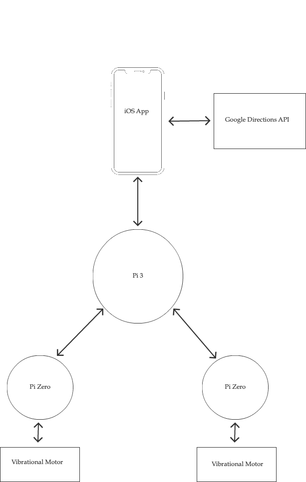

# Guidance
Guidance is a navigation system used to provide users with a way of traveling from point A to point B without the need to use their sense of sight or hearing.



### To-Do
* Add pybluez to requirements.txt
* Add infrastructure diagram

## Getting Started
These instructions will get you a copy of the project up and running on your local machine for development and testing purposes. Note: We use `dummy_data.py` for testing purposes to simulate the query of some API responding with the next direction and distance until then. Used SOLELY for testing purposes.

## Prerequisites
Prior to running this application, ensure that you've followed the steps below to ensure that your distribution of Linux is properly configured.

Using the command line interface, check that your devices bluetooth module is recognized
```
hciconfig
```

Afterwards, you will need the following packages in order for `pybluez` to properly compile on your system.
```
sudo apt-get install python-dev
sudo apt-get install libbluetooth-dev
```

Check the status of your bluetooth service. You should see the status as `active (running)`. Thus far, it has been safe to ignore the warning listed below when executing the command.
```
sudo service bluetooth status
```

From the previous command, right above active, you should see `loaded`. Take note of this path and modify the file at this location using your favorite text editor, vim!
```
vim /lib/systemd/system/bluetooth.service
```

Under `[Service]`, add the `-C` flag to the end of the `ExecStart` alias.
```
ExecStart=/usr/lib/bluetooth/bluetoothd -C
```

At this point, reboot your system so the device will recognize the changes.
```
sudo shutdown -h now
```

### **Optional, but highly recommended**
You may encounter an error that says
```python
_bluetooth.error: (13, 'Permission denied')
```

An easy, but not recommended, workaround is to run the script as the root user. We suggest the following. Make sure your pi user is in the bluetooth group.
```bash
cat /etc/group | grep bluetooth
```

If your device  is not, add `pi` to `bluetooth` group:
```bash
sudo usermod -G bluetooth -a pi
```

Change the group of the `/var/run/sdp` file:
```bash
sudo chgrp bluetooth /var/run/sdp
```

To make the change persistent after you reboot your device, create the file `/etc/systemd/system/var-run-sdp.path` with the following content:
```
[Unit]
Description=Monitor /var/run/sdp

[Install]
WantedBy=bluetooth.service

[Path]
PathExists=/var/run/sdp
Unit=var-run-sdp.service
```

Also add this file `/etc/systemd/system/var-run-sdp.service`:
```
[Unit]
Description=Set permission of /var/run/sdp

[Install]
RequiredBy=var-run-sdp.path

[Service]
Type=simple
ExecStart=/bin/chgrp bluetooth /var/run/sdp
```

Finally, start everything up:
```bash
sudo systemctl daemon-reload
sudo systemctl enable var-run-sdp.path
sudo systemctl enable var-run-sdp.service
sudo systemctl start var-run-sdp.path
```

## Installing
Clone the repository to your desired directory and cd into it.
```
git clone https://github.com/DarianNwankwo/guidance <desired_location>
cd <desired_location>
```

Now, create a virtual environment using your preffered method. Here, we'll use the following.
```
python3 -m venv <venv_name>
```

Now activate your newly created virtual environment
```
source activate <venv_name>/bin/activate
```

At this point, we can install the required dependencies using pip.
```bash
pip install -r requirements.txt
```

## Built With
* PyBluez
* RPi.GPIO
* pexpect

## Acknowledgments
* [@egorf](https://github.com/egorf) for providing this application with [bluetoothctl.py](https://gist.github.com/egorf/66d88056a9d703928f93)
